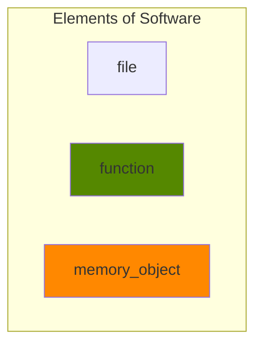
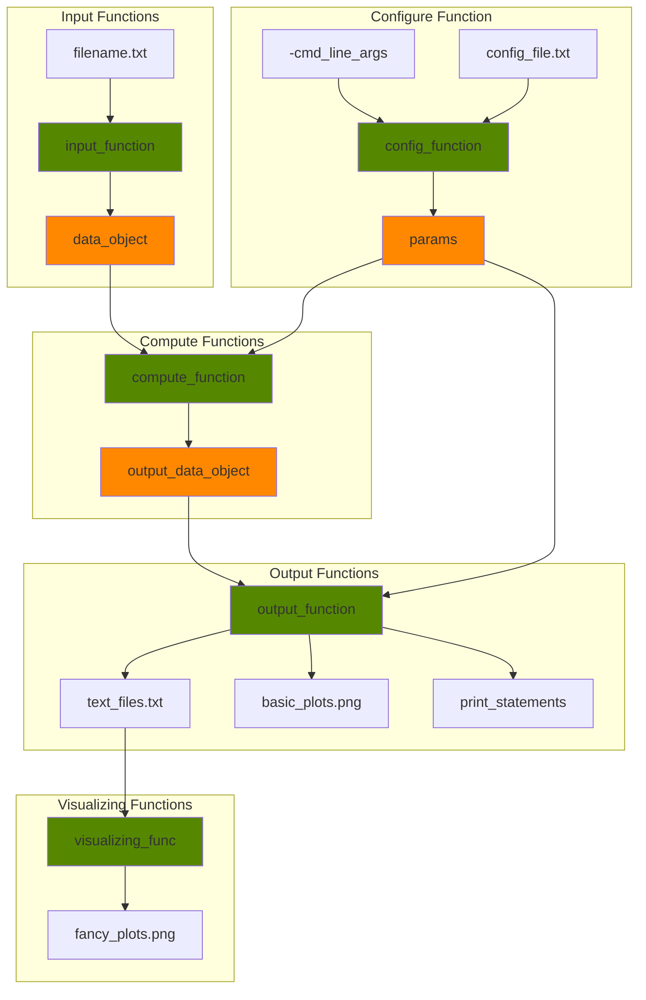

# Lesson 2: Software Design

This lesson describes the characteristics of clean software. 

## Overarching Principles
1. Separate <ins>code</ins> from <ins>data</ins> from <ins>analysis</ins> - literally 3 separate directories very far away from each other
2. There are two types of code:
    * "Research Code" vs. "Library Code"
    * Libraries are made of tools (useful for more than one project; useful for the rest of your life; useful for someone else)
    * Research code just applies the library code as necessary for ONE project (aka analysis).
3. Tools can be small, medium, or large:  Function --> Module --> Library 
4. Each function should be only <ins>one</ins> (not 2) of the following basic types: 
    * configure, input, compute, output, or coordinator 
5. <ins>Internal data formats</ins> are key to writing good code.  Think about how to get your data from any random source into a consistent internal data format (one that has inputs, outputs, utilities, etc.). 

## Functions
Functions are necessary for writing good code.  There are a few basic types of functions. 
* <ins>**config**</ins> - data from files into memory
* <ins>**input**</ins> - data from files into memory
* <ins>**compute**</ins> - memory into memory 
* <ins>**output**</ins> - memory into files 
* <ins>**coordinators**</ins> - string it all together
* <ins>**visualization/post-processing**</ins> - data files into pretty pictures
* Note: Files are on DISK.  Memory is in RAM. These are **not** the same thing. Memory objects disappear after the execution of the program.  Files stay on your hard drive after the execution of the program. 


### Schematic for Basic Scientific Program


### Your program: Configure, Input, Compute, Output


* Don't mix one type of function with another (e.g., a combined input-compute function)


## Function types in detail

### Configure
* Configure functions are used to set parameters of the computation. Sometimes they are used to parse command-line strings into more useful objects for the rest of the software.

* What is a 'config parameter'? 

  * Parameters can be strings, numbers, flags (0=False, 1=True), and other values.
  * Paramaters point to input and output directories for the computation, i.e. where the data lives. For complicated experiments, output directories should be given unique names to avoid automatically over-writing valuable results.
  * Parameters can be used to set constants.  What is the domain of the calculation? If doing a mathematical model, what is the elastic modulus, etc.?
  * Parameters can be used to set the types of outputs if that choice exists. Are you making a plot, writing a text file, or both?  Full or abridged outputs?    

* A config function's return value contains parameters that get used elsewhere in the computation. As the configure functions get more complicated (>8-10 parameters), sometimes it is convenient to store an object of parameter values (a dictionary or named tuple). In that case, the return value is an object.

* Dictionaries are really nice objects for configure functions
```
def configure(station_name):	
    config_dict = {'input_file': "../../GPS_POS_DATA/UNR_DATA/"+station_name+".txt", 
                   'outliers_definition': 10,   # in mm
                   'refframe': 'NorthAmerican', 
                   'outdir': 'NorthAmerican_'+station_name} 
    return config_dict;
```


### Input
* Input functions bring data from files into data structures in memory.  
* Input functions should be *clean*, or at least as clean as possible.  
* Their inputs are usually file names; their return values are usually arrays. 
* It should be easy to swap out your input files if your data comes in a different format. 
```
def read_inputs(file_name):	
    print("Reading file %s " % file_name);
    [east, north, up] = np.loadtxt(file_name, usecols=(3,4,5),skiprows=20);
    name=file_name.getline().split()[0];
    coords=file_name.getline().split()[1:2];
    myVelfield = Velfield(name=name, nlat=coords[1], elon=coords[0], n=n, e=e, u=u); # a named tuple of data
    return [myVelfield];
```


### Compute
* Compute functions are where the core of your program lives. They may loop over data, do mathematical computations, build models, or other cool things.  

* Compute functions take arrays of data (in memory) as their inputs. They should NOT know where the data came from, what format the data came in, or what file it lived in.  

* Compute functions also take in configuration parameters as their inputs. They should NOT have any hard-coded values (ideally). 

* Compute functions produce outputs that are arrays of data (in memory). They should NOT write to files. 

* Mathematical compute functions should be as pure and as separate as possible.  This allows the code to be easily fixed if you have a sign error, etc. 
  * It is okay to write a mathematical function with one line (it's better than copying the same math over and over, creating the potential for accidental mistakes!).  

* Compute functions should be designed with print statements, to allow the user to understand what the program is doing. These help debug problems when the program breaks. 
  * Good things to print: sizes of arrays, status of computation, error messages (divide by zero). 
```
def second_invariant(exx, exy, eyy):
	e2nd = exx*eyy - exy*exy;  # One-line mathematical compute function for strain tensor 
	return e2nd;
```


### Outputs
* Output functions bring data from data structures in memory to text files or plots. These plots may be complicated. Some plots are made simply for internal use only, to understand what happened. Other plots are production-quality, with many lines of fancy annotations. 

* There should be no computations in the output files.  They should be "unintelligent" functions. 

* Consider writing things such as the parameter values out to text files. These little notes become your "lab notebook" to remember how your experiments were run. 


### Driver

Drivers (or coordinators) orchestrate the rest of the program.  The simplest driver is: 
```
def program_driver():
	params = configure(*command_args);
	inputs = read_inputs(params);
	outputs = compute(inputs, params);
	write_outputs(outputs, params);
```
but drivers can also be much longer.  Drivers string the other types of functions together in complicated ways, loop over them, etc.


## Data Structures
### Python Built-in Data Structures
* Data structures help you accomplish the clean code described above. 
* Python has: 
  * Lists
  * Dictionaries 
  * Tuples
  * Numpy arrays
* It is important to understand the basic types of data structures in Python.  I use all 4 (arrays, lists, tuples, and dictionaries) quite frequently. 
* https://thomas-cokelaer.info/tutorials/python/data_structures.html

### Named tuples
Named tuples are wonderful objects!  They are basically containers for user-defined data. They can hold lists, arrays, integers, strings, etc.  I use them for almost everything I write.  
* https://docs.python.org/2/library/collections.html

## Unit Tests
* Used for Library code
* Separated from the main code
* Test a function on a KNOWN input, and "assert" that the answer matches a KNOWN output.
* The only place where hard-coding is really allowed!
* Allows you to find bugs in your library automatically 

## Projects

### Project 1a: 
* Person 1: (with some Python experience): Write a function to read an Earthquake Catalog into a named tuple. Read from the file in "Example_Data/". Push it to the "Code_Toolbox". We will all share this function.
* Person 2: (with some Python experience) Write a function to plot histograms of depth and magnitude of an earthquake catalog
* Person 3: Write a function to "write" an earthquake catalog into a text file
* Person N: Write a function to do something else with an earthquake catalog (anything you want!)  Ex: impose a bounding box.  Ex: Get maximum size. 
* How do you know that you've made correct functions?
* Everyone push your functions to the Tutorial_research_skills/Code_Toolbox github, and pull everyone else's. 
